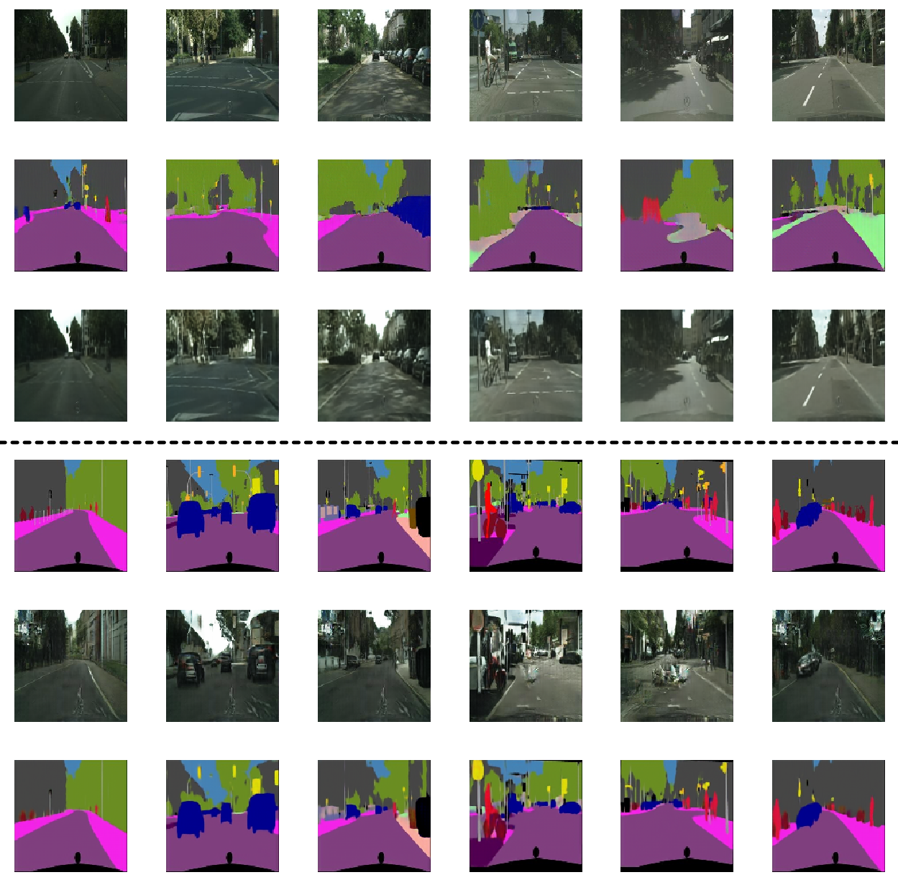

# cycleGAN-keras
Fully working keras implementation of cycleGAN in Python, realized during internship at University of Parma's <a href="http://implab.ce.unipr.it"> IMPLab </a>.

\[<a href="https://github.com/junyanz/CycleGAN"> Authors' repository</a> - <a href="https://arxiv.org/pdf/1703.10593.pdf">Paper</a> \]

<h2>Samples</h2>
<h3>horse2zebra</h3>
 
<h3>cityscapes</h3>
 
<h2>Usage</h2>
To download toy example datasets (check available datasets <a href="">here</a>) use the datasets script:
`sh datasets.sh dataset_name`  
To enable faster image loading into de network you can use hdf5 format by setting `use_hdf5=True` in `train` function in `cycleGAN.py`.  
To build .hdf5 datsets use the make_dataset script in datasets folder:
`python3 make_dataset.py dataset_path number_of_channels`  
For those with limited GPU resources I suggest downscaling the images through the `--img_size` argument (square images are input and output of the network).

<b>Dependencies</b>
<ul>
  <li>Python 3</li>
  <li>Tensorflow 1.2 or greater</li>
  <li>Keras 2.1.2</li>
  <li>keras-contrib</li>
  <li>h5py</li>
  <li>glob</li>
  <li>tqdm</li>
</ul>
